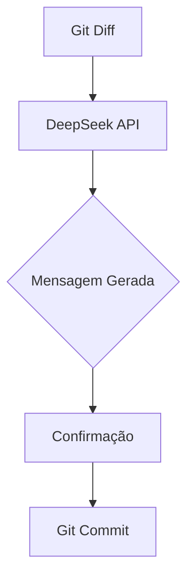

# Seshat 🤖

CLI para commits automatizados usando Conventional Commits e DeepSeek API  
*Mantenha um histórico de commits padronizado com ajuda de IA!*


---

## 📦 Instalação

```bash
# Instale via pip (recomendado)
pip install git+https://github.com/juniormartinxo/seshat.git

# Ou para desenvolvimento local
git clone https://github.com/juniormartinxo/seshat.git
cd seshat
pip install -e .
```

---

## 🔑 Primeiros Passos

### 1. Configure sua API Key
```bash
# Método persistente (armazena em ~/.seshat)
seshat config --api-key SUA_CHAVE_DEEPSEEK

# Ou via variável de ambiente
export DEEPSEEK_API_KEY="sua_chave_aqui"
```

### 2. Teste o fluxo
```bash
git add .
seshat commit --verbose
```

---

## 🚀 Comandos Principais

### `seshat commit`
Gera e executa commits inteligentes:

| Opção         | Descrição                              |
|---------------|----------------------------------------|
| `--model`     | Modelo de IA (`deepseek-coder-33b-instruct` padrão) |
| `-y/--yes`    | Confirmação automática                 |
| `-v/--verbose`| Detalhes técnicos do processo          |

**Exemplo completo**:
```bash
git add -A
seshat commit --model deepseek-coder-7b-instruct --yes
```

### `seshat config`
Gerencia configurações:
```bash
# Verificar configuração atual
seshat config

# Atualizar API Key
seshat config --api-key nova_chave_secreta
```

---

## ✨ Funcionalidades

- **Análise de Diff**: Processa alterações stageadas do Git
- **Prompt Otimizado**: Gera mensagens no padrão Conventional Commits:
  ```text
  feat: add user authentication middleware
  fix: resolve session expiration bug
  ```
- **Multiplos Métodos de Autenticação**:
  1. Argumento `--api-key`
  2. Variável de ambiente `DEEPSEEK_API_KEY`
  3. Arquivo de configuração `~/.seshat`

---

## ⚙️ Arquitetura Técnica



---

## 🛠️ Desenvolvimento

### Estrutura do Projeto
```
seshat/
├── core.py        # Lógica de geração de commits
├── cli.py         # Comandos e interface
├── utils.py       # Configurações e helpers
└── tests/         # Testes (em breve)
```

### Requisitos
- Python 3.8+
- Git instalado
- Acesso à API DeepSeek

---

## ❓ FAQ

### Como funciona o prompt interno?
O sistema envia este template para a API:
```text
Analise este diff do Git e sugira uma mensagem de commit seguindo o padrão Conventional Commits. 
Seja conciso e técnico. Destaque a intenção principal das mudanças.
```

### Posso usar modelos customizados?
Sim! Basta especificar qualquer modelo suportado pela DeepSeek:
```bash
seshat commit --model seu-modelo-customizado
```

---

## ⚠️ Limitações

- Requer arquivos stageados (`git add`)
- Dependente da disponibilidade da API DeepSeek
- Mensagens muito longas podem ser truncadas

---

Feito com ❤️ por [Junior Martins](https://github.com/juniormartinxo)  
📄 Documentação completa: [Wiki do Projeto](https://github.com/juniormartinxo/seshat/wiki)  
🐛 Reportar problemas: [Issues](https://github.com/juniormartinxo/seshat/issues)
```